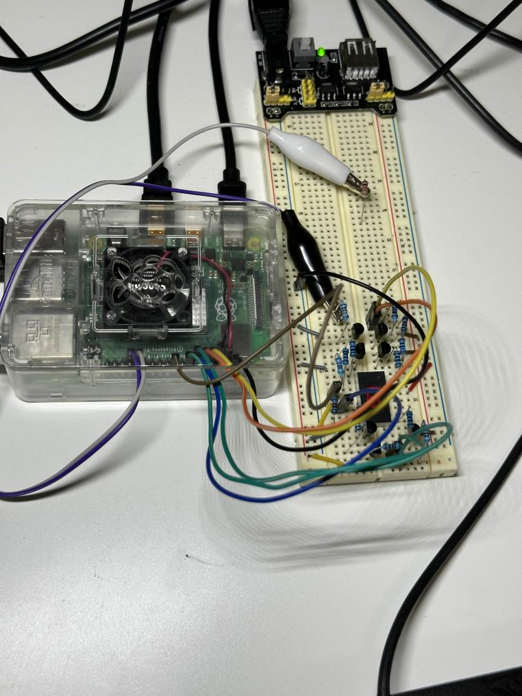

# raspberry.pi.electronic

## Current Project

### Seven Segment Display

[](media/seven-segment.mp4)


## Setup Github

### New ssh keys

* ssh-keygen
* ```cat .ssh/id_rsa.pub```
* copy the text
* https://github.com/settings/keys
* paste the text as new key

